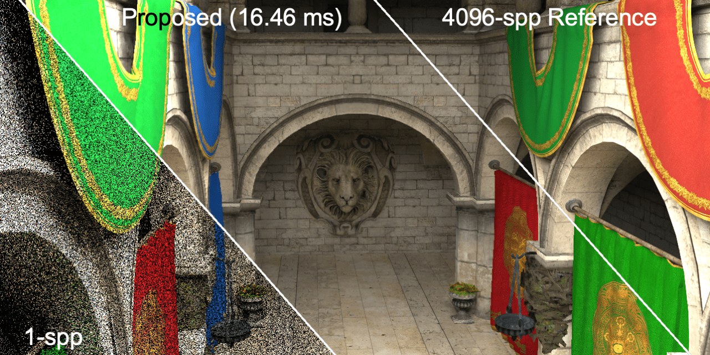

## Real-time Monte Carlo Denoising with the Neural Bilateral Grid
Open source of our EGSR 2020 paper "Real-time Monte Carlo Denoising with the Neural Bilateral Grid"

### Introduction
This work is based on our 
[EGSR 2020 paper](https://drive.google.com/file/d/1Dc-j-8G6-mJ3wgjkifrTsjRcxOBnqiaa/view?usp=sharing),
[Supplementary Material](https://drive.google.com/file/d/1ck65mW_SJvdrwohiWKFbWUhhgZjHei5k/view?usp=sharing),
and [Supplementary Video](https://youtu.be/9PVR1-GTt6g).

Real-time denoising for Monte Carlo rendering remains a critical challenge with regard to the demanding requirements of both high fidelity and low computation time. In this paper, we propose a novel and practical deep learning approach to robustly denoise Monte Carlo images rendered at sampling rates as low as a single sample per pixel (1-spp). This causes severe noise, and previous techniques strongly compromise final quality to maintain real-time denoising speed. We develop an efficient convolutional neural network architecture to learn to denoise noisy inputs in a data-dependent, bilateral space. Our neural network learns to generate a guide image for first splatting noisy data into the grid, and then slicing it to read out the denoised data. To seamlessly integrate bilateral grids into our trainable denoising pipeline, we leverage a differentiable bilateral grid, called neural bilateral grid, which enables end-to-end training. In addition, we also show how we can further improve denoising quality using a hierarchy of multi-scale bilateral grids. Our experimental results demonstrate that this approach can robustly denoise 1-spp noisy input images at real-time frame rates (a few milliseconds per frame). At such low sampling rates, our approach outperforms state-of-the-art techniques based on kernel prediction networks both in terms of quality and speed, and it leads to significantly improved quality compared to the state-of-the-art feature regression technique.

### Citation
If you find our work useful in your research, please consider citing:

  @inproceedings {Meng2020Real,
  booktitle = {Eurographics Symposium on Rendering 2020},
  title = {{Real-time Monte Carlo Denoising with the Neural Bilateral Grid}},
  author = {Xiaoxu Meng, Quan Zheng, Amitabh Varshney, Gurprit Singh, Matthias Zwicker},
  year = {2020},
  publisher = {The Eurographics Association},
  }

### Installation
1. Install tensorflow == 1.13.1.
2. Clone this repo, and we'll call the directory ${MCDNBG_ROOT}.
3. TODO

### Pre-trained models
Download pre-trained models from TODO, and unzip the file to ${MCDNBG_ROOT}/model.

### Running the code
1. Evaluate on the 1-spp BMFR dataset.
  TODO

2. Evaluate on the 64-spp BMFR dataset.
  TODO
